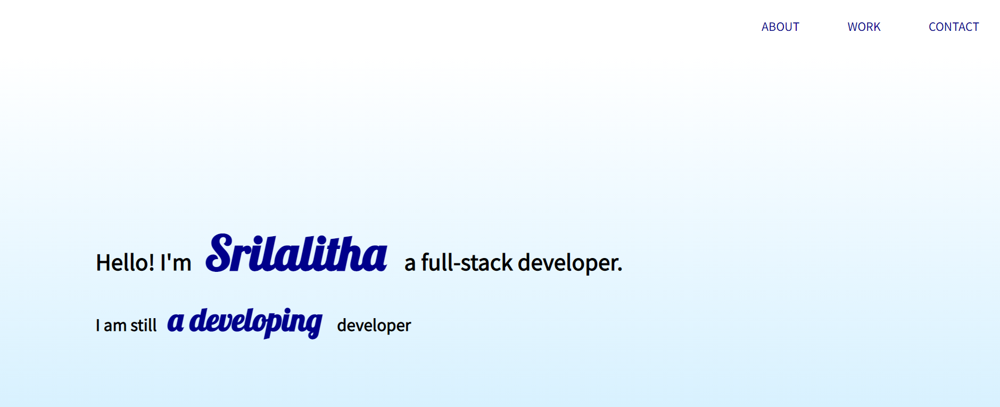
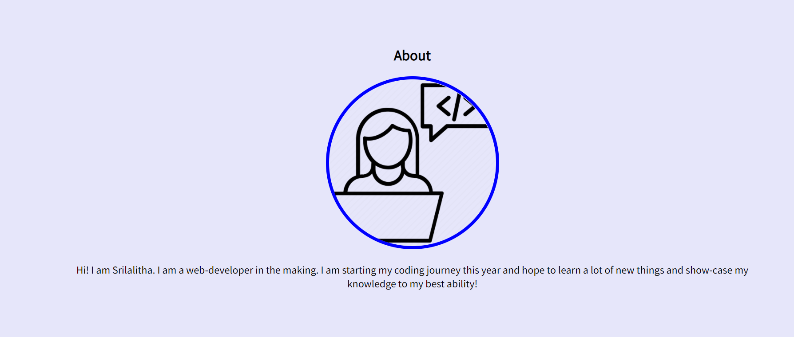
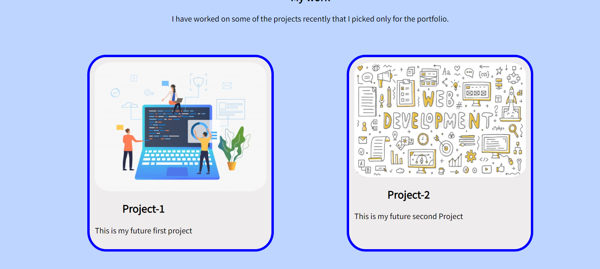
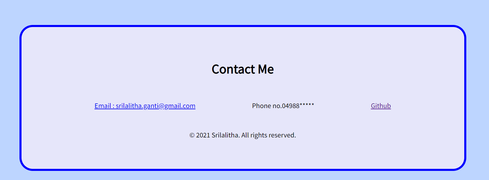

# Portfolio-Srilalitha Nookala

### Basic Portfolio with HTML,CSS

## Hello Developers

## INTRODUCTION

Hello Developers! MY name is Srilalitha. I am currently learning full-stack web development from Monash Bootcamp and looking to start a career in web-development soon!
I have created a Portfolio Website to showcase my work.

# SKILLS

HTML, CSS

# ASSETS

The following are the screenshots of the website's appearance : 

The following is the deployed code to Portfoilo: https://github.com/SrilalithaN/Portfolio
The following is the deployed application to the Portfolio: https://srilalithan.github.io/Portfolio/
